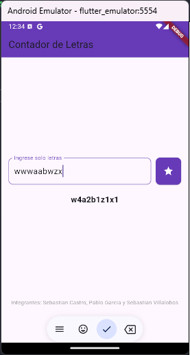

# TallerCompuMovil

Este proyecto es una aplicación móvil desarrollada en Flutter que permite contar la frecuencia de letras en un texto ingresado, ignorando diferencias entre mayúsculas y minúsculas. La aplicación fue creada como parte de un taller de computación móvil.

## Características

- Permite ingresar cualquier cantidad de letras en un campo de texto.
- Cuenta y muestra la frecuencia de cada letra en el formato solicitado (ejemplo: `wwwaabwzx` salida:`w4a2b1z1x1` ).
- Solo permite ingresar letras (sin números ni caracteres especiales).
- Interfaz simple y atractiva, con un diseño de botón e icono estilo Google.
- Al ingresar al campo de texto, el teclado se despliega automáticamente.
- Muestra los nombres de los integrantes en la parte inferior de la pantalla.

## Captura de pantalla



## Tecnologías Utilizadas

- **Flutter**: Framework para desarrollo de aplicaciones multiplataforma.
- **Dart**: Lenguaje de programación utilizado en Flutter.

## Instalación

1. Clona este repositorio:
   ```bash
   git clone https://github.com/Itadoriii/TallerCompuMovil.git
